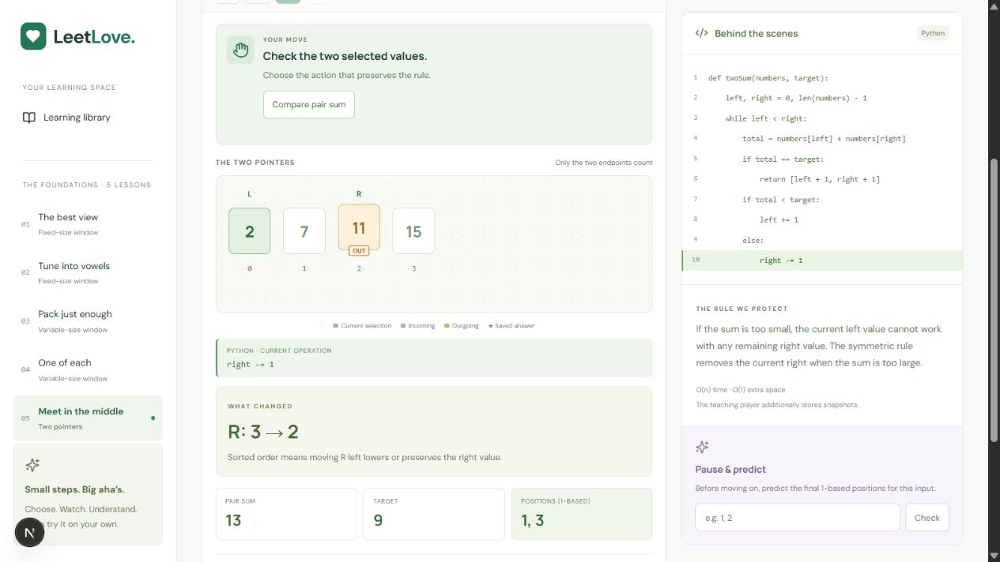
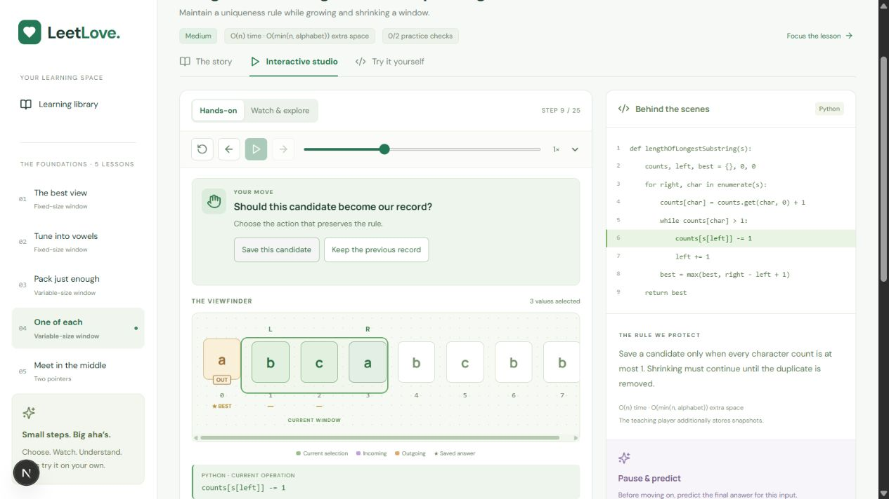
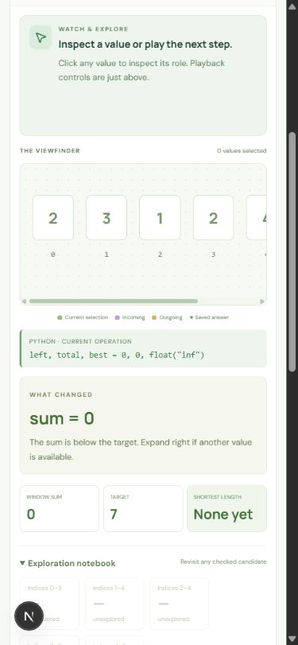

# Stage 2 independent critic — round 1

**Verdict: 7.4/10 overall. Not accepted; the requested gate is 8.5 for every lesson.**

Review performed independently of the builder using the live localhost app, desktop screenshots (1265×712) and a narrow 390×844 viewport. This resumed an interrupted critic pass, incorporating the original round-1 images and taking fresh `resumed-*` screenshots to verify the main findings. No application files were edited by the critic.

| Lesson | Score | Assessment |
|---|---:|---|
| Maximum Average Subarray I | 8.1 | Correct readable window/result states; preserved direct interaction. Shared hierarchy/focus issue limits clarity. |
| Maximum Number of Vowels | 8.0 | Character contribution and gold winning range are legible. Same oversized prompt and offscreen transport issue. |
| Minimum Size Subarray Sum | 7.2 | Correct target/sum explanation, but shrinking changes the pointer beyond the highlighted code operation. |
| Longest Substring Without Repeating Characters | 6.8 | Invalid duplicate window looks valid; both duplicate characters are not identified on the canvas. Shrink/code mismatch also occurs. |
| Two Sum II | 7.0 | Good non-contiguous selection and decision feedback, but the new endpoint is marked outgoing. |

## Ranked fixes for the builder

1. **Correct outgoing markers in Two Sum II.** After moving R from index 3 (15) to index 2 (11), the new selected 11 is amber and labeled OUT while discarded 15 is neutral. This reverses the visual meaning of the action. Preserve the previous endpoint as outgoing and emphasize the new endpoint separately. Live evidence: `resumed-pointers-out.png`; original: `two-pointers-move.png`.
2. **Make shrinking code and movement agree.** Minimum and uniqueness lessons both update L while highlighting only `total -= nums[left]` or `counts[s[left]] -= 1`. The learner sees two operations represented by one code line. Show both semantic lines for that snapshot or split the operations into separate frames. Live evidence: `resumed-unique-shrink.png`; original: `minimum-shrink.png`.
3. **Visualize invalid uniqueness directly.** At `abca`, the boundary and existing cells remain green; only the entering `a` is purple. The text says duplicate, but the canvas does not identify the conflict. Mark both a cells, label the window invalid, and return to valid styling only after repair. Evidence: `resumed-unique-duplicate.png`, `unique-duplicate.png`.
4. **Tighten entry and focus layout.** Initial title/navigation/large action panel pushes the array to the viewport bottom. Focus scrolls the prompt to the top and hides transport, even in watch mode whose prompt says controls are above. Reduce unused prompt height and keep transport, decision, and array together where practical. Evidence: `average-initial.png`, `resumed-average.png`, `resumed-mobile-minimum.png`.

## What worked

- Wrong two-pointer choice leaves the step unchanged and offers targeted feedback; correct decisions reach the gold final pair.
- The notebook distinguishes checked and unexplored candidates.
- Final fixed-window and uniqueness results clearly mark the winning range in gold.
- Minimum lesson's mobile canvas scrolls horizontally within its container; current Python operation remains next to the visualization.
- Local continuation was visible across routes. The review did not reset library practice records.

## Evidence and limits

Original desktop sequence screenshots in `round-1/` cover all five lessons: initial, wrong action, add/remove or pointer movement, comparison, and final states. Fresh screenshots cover library, average, vowels, uniqueness duplicate/repair, two-pointer wrong/move/final, and minimum mobile. State transitions were exercised through UI buttons and keyboard timeline controls; screenshots verify visible state and correspondence. They do **not** establish frame rate, continuous animation timing, or learning effectiveness. No production-ready claim is made from this score.

Representative evidence:

