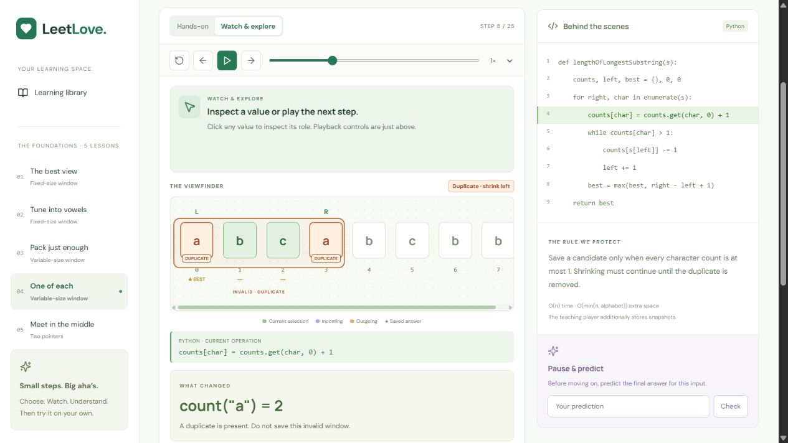
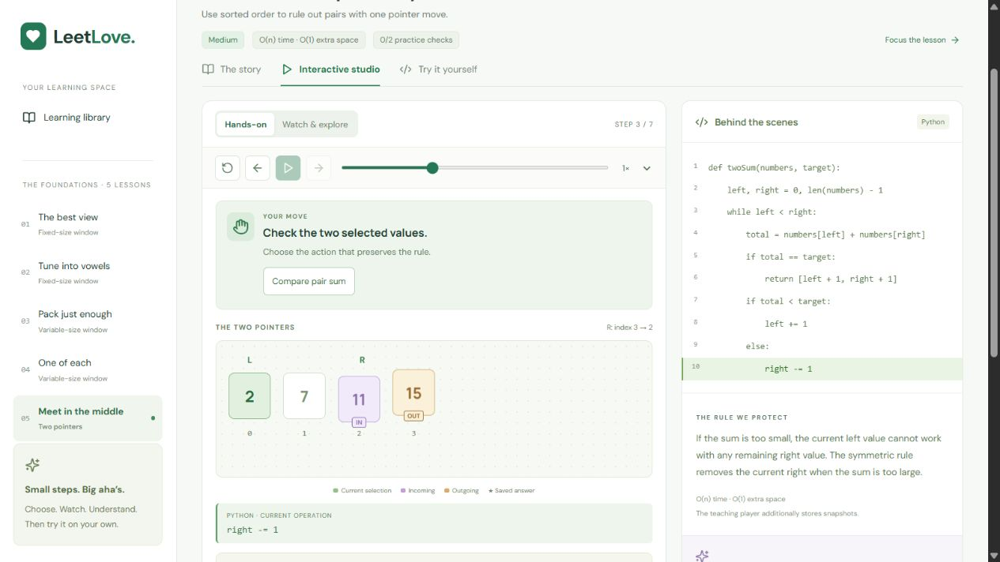
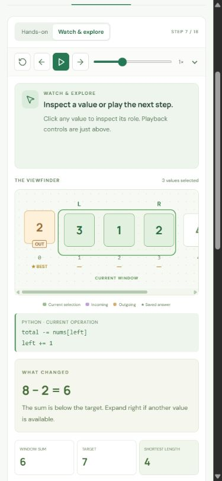
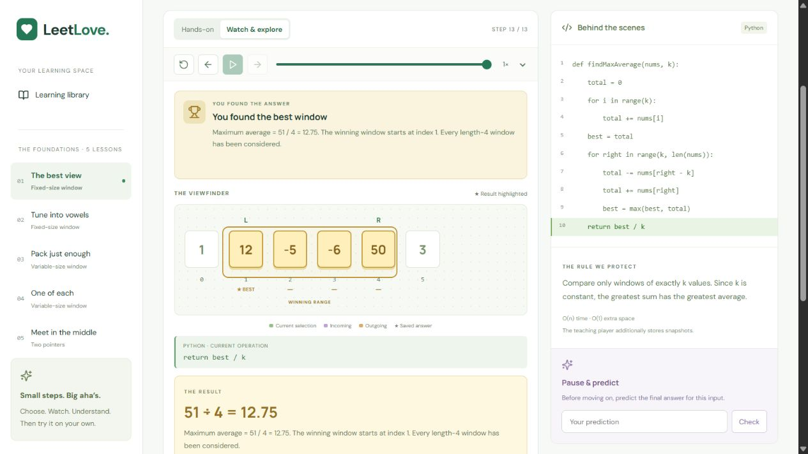

# Stage 2 independent critic — round 2

**Verdict: 8.6/10 overall. Accepted: every lesson meets the requested 8.5 gate.**

Reviewed 2026-09-20 by a separate critic agent, without application edits. Candidate: application code at commit `0b4d885`, served from the production build at `http://localhost:3002`. Port 3000 was serving an unrelated application and was not used for this review. Desktop evidence is 1265×712; responsive evidence is 390×844. The temporary viewport override was reset.

| Lesson | Score | Assessment |
|---|---:|---|
| Maximum Average Subarray I | 8.6 | Direct choices and wrong-action feedback remain clear. Focus retains transport and canvas; settled gold range covers indices 1–4 and agrees with 51 / 4 = 12.75. |
| Maximum Number of Vowels | 8.5 | Character contribution is legible, with a clear fixed frame and settled winning `iii` range. Consonant contribution is explained beside the operation. |
| Minimum Size Subarray Sum | 8.6 | Shrink now shows both subtraction and L increment. Outgoing 2, remaining [3,1,2], and 8 − 2 = 6 agree. Final [4,3] range and length 2 agree. |
| Longest Substring Without Repeating Characters | 8.7 | Both conflicting a cells and the invalid boundary are unmistakable. Correct removal restores green validity and highlights both executed code lines. Final abc and length 3 agree. |
| Two Sum II | 8.7 | Old endpoint 15 is OUT and new endpoint 11 is IN; R index 3→2 is explicit. Only endpoints contribute, wrong choice is held with feedback, and final positions [1,2] agree with the gold 2 and 7 pair. |

## Round-1 fixes verified

1. **Endpoint direction fixed.** Live hands-on compare → wrong L choice → correct R choice verified discarded and incoming meanings. Evidence: `two-pointers-initial.png`, `two-pointers-wrong.png`, `two-pointers-move.png`, `two-pointers-final.png`.
2. **Shrink/code agreement fixed.** Minimum and unique snapshots show the decrement and `left += 1` in both the inline operation and full Python panel. Evidence: `minimum-shrink.png`, `unique-repaired.png`, `mobile-minimum-shrink.png`.
3. **Duplicate validity fixed.** Both a tiles carry DUPLICATE labels, the boundary is amber, and the badge directs shrinking. Attempting to save keeps the invalid state; removing left restores validity. Evidence: `unique-duplicate.png`, `unique-wrong.png`, `unique-repaired.png`, `mobile-unique-duplicate.png`, `mobile-unique-repaired.png`.
4. **Focus hierarchy improved.** Focus brings mode, transport, decision, array, and current operation into a coherent viewport on desktop and mobile. Minimum wrong-action feedback remains adjacent to the decision. The narrow array scrolls inside its container rather than expanding the page. Evidence: `minimum-wrong.png`, `mobile-minimum-shrink.png`, `mobile-pointers-final.png`.

## Coverage and evidence handling

The critic independently inspected the six earlier round-2 fixed-window screenshots (initial/focused, wrong, added, consonant, final). The earlier `average-final.png` was captured during a transition and is **not** evidence of the settled final range. Fresh production captures `average-final-settled.png`, `vowels-final-settled.png`, `minimum-final-settled.png`, and `unique-final-settled.png` supersede transient final images. All five settled answers and selected ranges were checked against the visible operation and result. Fresh live flows cover minimum wrong action and shrink, unique wrong save and repair, two-pointer wrong/correct decisions and completion, plus focused responsive layouts.

## Remaining optional polish, ranked

1. The watch prompt still contains appreciable empty space. A smaller prompt could expose more metrics without scrolling, especially before Focus is selected.
2. Tiny legend and notebook labels are readable at desktop scale but could use slightly larger type and stronger contrast.
3. Long arrays require horizontal scrolling; a subtle persistent overflow cue would improve discovery beyond the native scrollbar.

These are refinements rather than blockers to understanding the reviewed flows. No additional builder round is required by the requested gate.

## Limits

The score evaluates visible state clarity, step-to-step visual correspondence, and animation destination accuracy. Screenshots do not establish continuous frame rate, interpolation quality on every device, or learner effectiveness. No learner study or universal production-readiness claim follows from this critic score. Functional tests and production persistence checks are documented separately by the builder.

